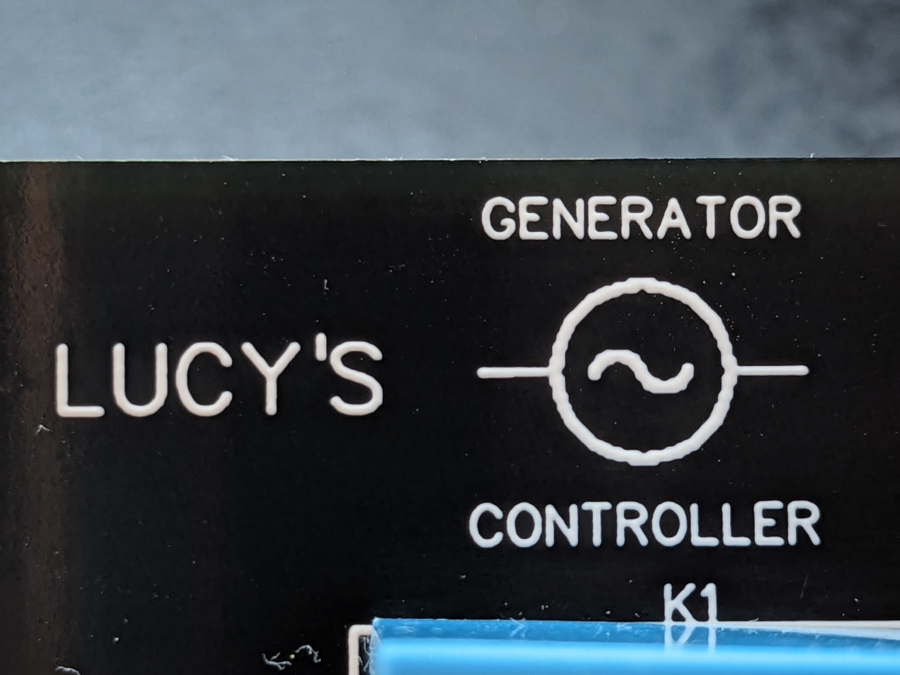
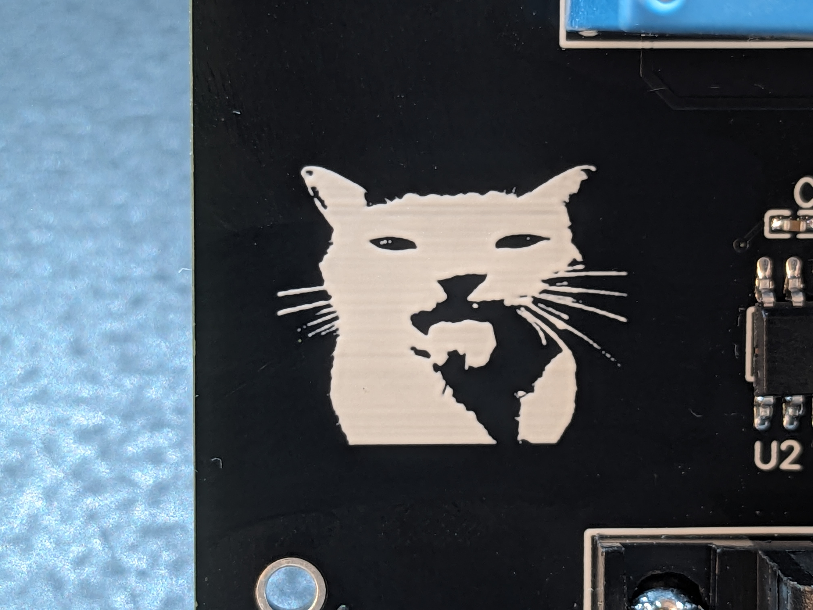
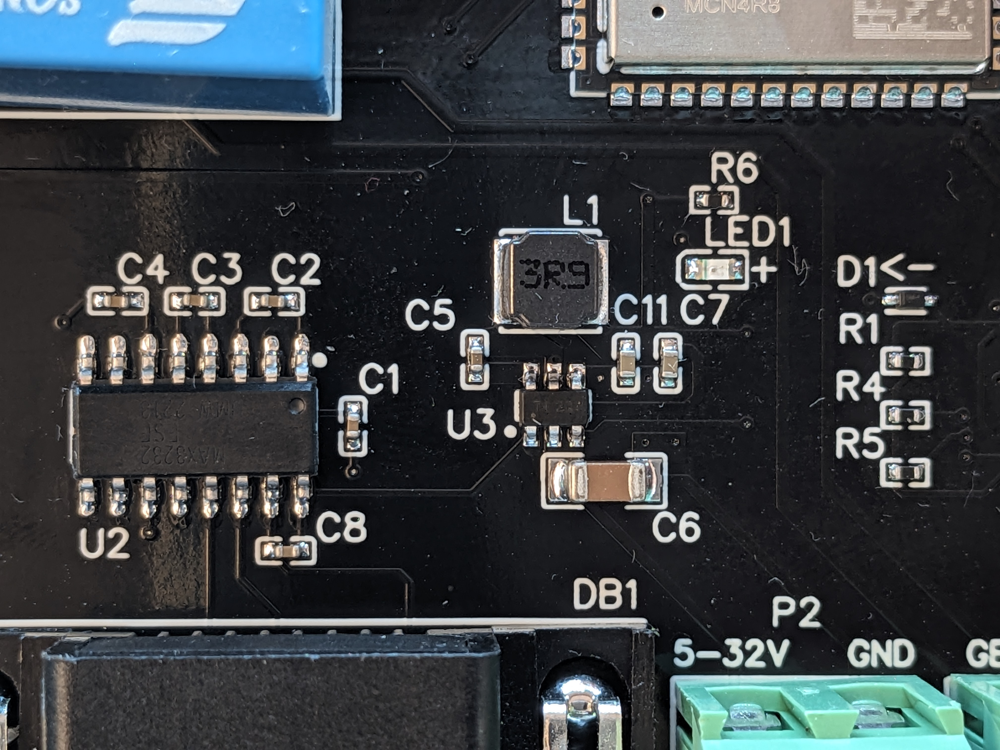

# Arduino code and schematics for my generator controller project

The PCB and schematic are in Easy EDA format, you can import them into there to view or modify.

CRC generation code from https://github.com/manio/skymax-demo

